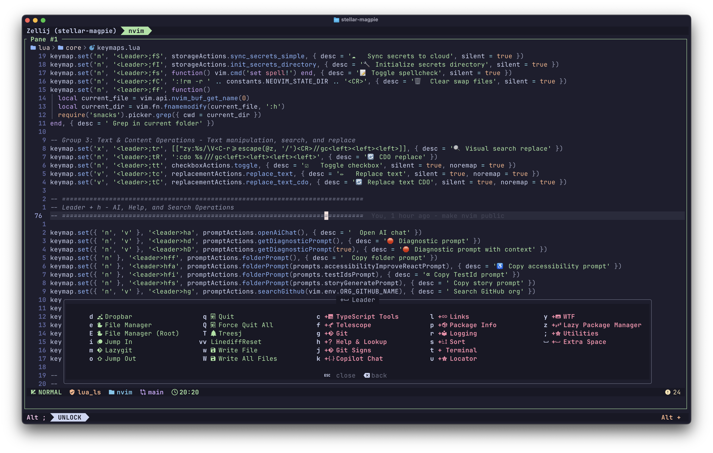

# Jimmy's Neovim Configuration

[](https://www.lua.org)
[](LICENSE)



A **performance-focused**, **productivity-driven** Neovim configuration built with Lua. Designed for developers who want a powerful IDE experience without the bloat.

## What Makes This Config Special

### Opinionated & Optimized
- **Zero startup lag** with aggressive lazy loading and performance optimizations
- **Modular architecture** with clear separation between core, plugins, and custom utilities
- **Battle-tested** plugin choices focused on stability and performance

## Tech Stack

| Component | Technologies |
|-----------|--------------|
| **Core** | Neovim 0.10+, Lua 5.1+, lazy.nvim |
| **Completion** | Blink.cmp (Rust-based), GitHub Copilot |
| **LSP** | Mason, nvim-lspconfig (20+ language servers) |
| **Syntax** | Treesitter, nvim-treesitter-textobjects |
| **AI** | OpenCode.nvim, CopilotChat.nvim, WTF.nvim |
| **Git** | LazyGit, Fugitive, GitSigns |
| **Navigation** | Snacks.picker, Yazi, Hop, Leap, Arrow |
| **UI** | Catppuccin, Lualine, Snacks.nvim, Dropbar |
| **Integrations** | Todoist API, Jira API, GitHub API |

### Unique Custom Features
- **Todoist Integration** - Full API integration with project management and priority setting
- **Jira Integration** - Direct task creation and linking from within Neovim
- **Journal System** - Personal journaling with timestamped entries
- **GitHub Integration Suite** - Repository management, organization switching, PR workflows
- **Custom Git Workflows** - Branch creation with Jira integration, automated commits
- **Code Analysis** - Knip integration for unused code detection and cleanup
- **Advanced File Operations** - Recursive content copying, asset management, clipboard operations

## Plugin Ecosystem

This configuration includes **45+ carefully selected plugins** organized into specialized categories:

### Core Development Stack
| Category | Plugin | Description |
|----------|--------|-------------|
| Completion | Blink.cmp | Rust-based, ultra-fast autocompletion |
| LSP | Mason + nvim-lspconfig | 20+ language servers with auto-installation |
| Syntax | Treesitter + textobjects | Advanced parsing and smart text objects |
| Fuzzy Finding | Snacks.picker | Modern picker replacing Telescope |
| File Management | Yazi | Modern terminal file manager |
| Git | LazyGit + Fugitive + GitSigns | Complete Git workflow |

### AI & Productivity
| Plugin | Description |
|--------|-------------|
| OpenCode.nvim | Direct AI assistant with operator-based context selection |
| GitHub Copilot | AI code completion with inline suggestions |
| CopilotChat.nvim | AI chat with code review, explain, fix, optimize |
| WTF.nvim | AI-powered diagnostic debugging |
| LeetCode.nvim | Full LeetCode workflow with testing and submission |
| Typr | Typing speed practice and statistics |

### Navigation & Editing
| Plugin | Description |
|--------|-------------|
| Hop + Leap | Quick cursor movement and jumping |
| Arrow | File bookmarks for quick navigation |
| nvim-surround | Intelligent text surrounding |
| TreeSJ | Smart split/join code blocks |
| substitute.nvim | Advanced find and replace |
| mini.ai | Enhanced text objects |

### Visual & UI
| Plugin | Description |
|--------|-------------|
| Catppuccin | Beautiful, consistent color scheme |
| Snacks.nvim | Dashboard, notifications, terminal utilities |
| Dropbar | Contextual navigation breadcrumbs |
| Lualine | Custom bubble-style statusline |
| wilder.nvim | Enhanced command-line completion |
| nerdy.nvim | Nerd Font icon picker |
| Floaterm | Quick floating terminal |

### Language Support
| Language | Features |
|----------|----------|
| TypeScript/JavaScript | typescript-tools, ESLint integration, import organization |
| Java | nvim-java with Maven/Gradle, Android emulator control |
| Lua | Full Neovim API completion |
| HTML/CSS | ts-autotag, Tailwind support (optional) |
| Python, Go, Rust | LSP + formatters + debuggers |

## Custom Modules

### Actions (14 modules)
- **todoist.lua** - Complete Todoist API integration with project filtering and priorities
- **jira.lua** - Jira task creation with ticket linking
- **journal.lua** - Personal journaling system
- **git.lua** - Sophisticated Git workflows with Jira branch naming
- **github.lua** - GitHub organization and repository management
- **language.lua** - Multi-language development tools (Java, TypeScript, ESLint, Knip)
- **files.lua** - Advanced file operations and clipboard integration
- **links.lua** - Environment-aware URL handling
- **errors.lua** - Diagnostic copying and analysis
- **checkbox.lua** - Markdown checkbox toggling
- **replacement.lua** - Buffer and project-wide search/replace
- **documentation.lua** - README convention management
- **editor.lua** - Spellcheck, wrap toggle, editor utilities
- **buffers.lua** - Buffer management operations

### Utilities (14 modules)
- **http.lua** - Async HTTP client with GET/POST/PATCH
- **todoist.lua** - Todoist API client
- **github.lua** - GitHub integration helpers
- **git.lua** - Git operations and branch utilities
- **files.lua** - File system operations
- **input.lua** - User input handling
- **json.lua** - JSON parsing with error recovery
- **async.lua** - Non-blocking command execution
- **url.lua** - URL manipulation
- **string.lua** - String utilities
- **array.lua** - Array helpers
- **validation.lua** - Input validation
- **ui.lua** - UI utilities
- **errors.lua** - Error handling
- **language.lua** - Language detection utilities
- **links.lua** - Link generation helpers

## Architecture

```
nvim/
├── init.lua                    # Entry point
├── lazy-lock.json              # Plugin version lockfile
└── lua/
    ├── core/                   # Essential configuration
    │   ├── lazy.lua            # Plugin manager bootstrap
    │   ├── options.lua         # Neovim settings
    │   ├── plugins.lua         # Plugin loader
    │   ├── commands.lua        # Autocommands & automation
    │   ├── keymaps.lua         # 175+ organized keybindings
    │   ├── statusline.lua      # Custom Lualine design
    │   └── constants.lua       # Global constants & colors
    │
    ├── plugins/                # 45+ plugin configurations
    │   ├── blink.lua           # Completion engine
    │   ├── snacks.lua          # Modern utility suite
    │   ├── opencode.lua        # AI assistant
    │   ├── copilot.lua         # GitHub Copilot
    │   ├── copilot-chat.lua    # Copilot Chat
    │   ├── leetcode.lua        # LeetCode integration
    │   ├── treesitter.lua      # Syntax highlighting
    │   ├── mason-lspconfig.lua # LSP management
    │   ├── lazygit.lua         # Git TUI
    │   ├── fugitive.lua        # Git commands
    │   ├── yazi.lua            # File manager
    │   └── disabled/           # Optional plugins (11)
    │
    └── custom/                 # Unique productivity features
        ├── actions/            # 14 automation modules
        ├── utils/              # 14+ utility libraries
        └── constants/          # Configuration constants
```

## Disabled Plugins

The `lua/plugins/disabled/` directory contains plugins that can be re-enabled as needed:

| Plugin | Reason |
|--------|--------|
| avante.lua | Replaced by OpenCode |
| barbar.lua | Prefer minimal UI |
| codecompanion.lua | Replaced by OpenCode |
| dadbod-ui.lua | Database UI (optional) |
| dap.lua | Debugger (optional) |
| git-conflict.nvim | Using LazyGit + Fugitive |
| hardtime.nvim | Training plugin (optional) |
| neotest.lua | Test runner (optional) |
| rayso.nvim | Limited use case |
| tabout.nvim | Conflicts with Blink.cmp |
| tailwind-tools.lua | Tailwind support (optional) |

## Performance

- **Startup time**: ~25ms with 45+ plugins
- **Memory usage**: ~18MB baseline
- **Plugin loading**: Aggressive lazy loading, 0ms blocking
- **LSP response**: Sub-100ms completion time

## License

Apache 2.0
